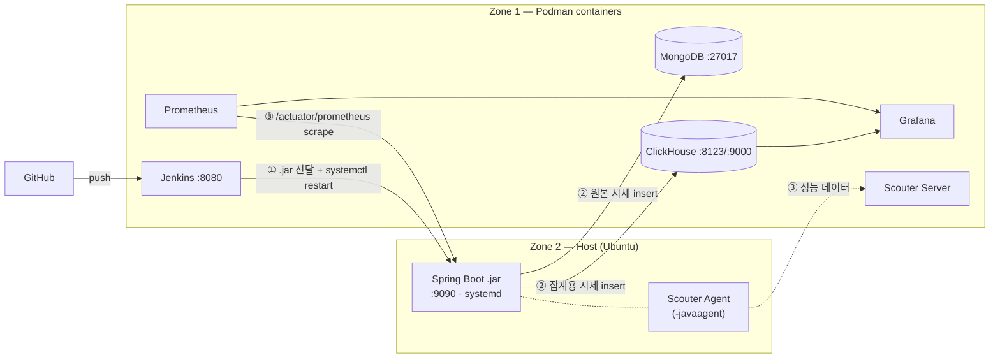

# 🥔 감자 코인 트래커 — 아키텍처

> 기획 원문(다른 AI가 작성)을 정리한 문서. 구현 진행에 따라 이 문서를 갱신한다.

## 한 줄 요약

1초마다 가짜 "감자 코인" 시세를 생성하는 Spring Boot 앱을 **호스트에서 직접 실행**하고,
그 주변 인프라(빌드/DB/모니터링)는 **전부 Podman 컨테이너**로 돌리는 하이브리드 구성.
목적은 서비스 자체가 아니라 **회사에서 쓰는 기술 스택 습득**이다.

## 왜 하이브리드인가

앱까지 컨테이너에 넣으면 "컨테이너 다루는 법"만 배우게 된다.
회사 실무 환경은 보통 **호스트 JVM + systemd + 외부 인프라** 형태이므로,
앱은 호스트에서 순수 Ubuntu 자원으로 돌려 그 환경을 그대로 모방한다.
반대로 설치/삭제가 번거로운 미들웨어는 컨테이너로 격리해 호스트를 더럽히지 않는다.

## Zone 1 — 인프라 구역 (Podman 컨테이너)

| 구성요소 | 역할 | 현재 상태 |
|---|---|---|
| **Jenkins** | GitHub에서 코드를 받아 빌드하고, 호스트로 `.jar`을 전달하는 CI/CD 파이프라인 | ✅ 배포됨 |
| **MongoDB** | 가공 전 원본(Raw) 시세 데이터 저장소 | ✅ 배포됨 |
| **ClickHouse** | 초당 쏟아지는 시세를 실시간 집계하는 시계열 분석용 DB | ✅ 배포됨 |
| **cloudflared** | 외부에서 서버에 접근하기 위한 Cloudflare 터널 | ✅ 배포됨 |
| **Prometheus** | 호스트 Spring Boot의 Actuator를 주기적으로 scrape (CPU/메모리 등) | ⬜ 미배포 |
| **Grafana** | ClickHouse(시세) + Prometheus(시스템)를 묶어 대시보드 시각화 | ⬜ 미배포 |
| **Scouter Server** | APM 컬렉터. 응답시간·쿼리시간 등 성능 데이터 수집/저장 | ⬜ 미배포 |

## Zone 2 — 애플리케이션 구역 (호스트 직접 실행)

| 구성요소 | 역할 | 현재 상태 |
|---|---|---|
| **Spring Boot App (`.jar`)** | 1초마다 감자 코인 시세 생성. systemd 서비스로 등록 | 🟡 systemd 등록·가동 중이나 **시세 생성 로직 없음** (`GET /test`만 존재) |
| **Scouter Agent** | JVM에 `-javaagent`로 붙어 성능 측정 → Zone 1의 Scouter Server로 전송 | ⬜ 미적용 |

앱은 `/home/bombi/deploy/potato-coin-tracker/app/app.jar`에 배치되고,
같은 폴더의 `deploy.sh`가 `sudo systemctl restart potato-coin`으로 재기동한다.

## 데이터 플로우

### ① CI/CD 배포 — ✅ 구현 완료

GitHub push → Jenkins(컨테이너)가 감지 → 빌드 → `scp`로 호스트에 `.jar` 전달 →
`ssh`로 호스트의 `deploy.sh` 실행 → `systemctl restart potato-coin`

Jenkins 컨테이너는 자기 SSH 키(`/var/jenkins_home/.ssh/id_rsa`)로 호스트에 접속한다.
단계별 상세는 [infrastructure.md](infrastructure.md#cicd-파이프라인)에 있다.

### ② 데이터 생성
Spring Boot(호스트)가 1초마다 시세 갱신 → MongoDB(원본)와 ClickHouse(집계) 양쪽에 적재

### ③ 모니터링
- Scouter Agent(호스트) → Scouter Server(컨테이너): 쿼리/응답 소요시간
- Prometheus(컨테이너) → Spring Boot(호스트) Actuator: 시스템 상태
- Grafana에서 시세 그래프 + 서버 상태를 한 화면에서 관제

## 미해결 설계 이슈

작업을 진행하기 전에 결정이 필요한 부분들.

1. **컨테이너 → 호스트 네트워크 접근**
   Prometheus(컨테이너)가 호스트의 `:9090`을 긁어야 한다. Jenkins 파이프라인이 이미
   호스트 LAN IP(`192.168.0.177`)로 접속하고 있으므로 같은 방식을 쓸 수 있다.
   `host.containers.internal` 사용 여부와 함께 결정할 것.

2. **Prometheus 포트와 앱 포트 충돌**
   Prometheus 기본 포트는 9090인데 앱도 `server.port: 9090`을 쓴다.
   앱은 호스트, Prometheus는 컨테이너라 포트 매핑만 다르게 하면 되지만
   Prometheus 컨테이너를 `9090:9090`으로 노출하면 충돌한다. 한쪽 포트를 옮길 것.

4. **MongoDB / ClickHouse 인증**
   현재 두 DB 모두 인증 없이 포트가 열려 있다. cloudflared 터널이 붙어 있는 서버이므로
   최소한 계정 설정은 하고 가는 편이 좋다.

5. **Scouter 버전/호환성**
   Scouter가 Java 21 + Spring Boot 4 조합에서 동작하는지 확인 필요. 안 되면 Pinpoint 등 대안 검토.

## 참고

- 서버 경로·포트·운영 명령: [infrastructure.md](infrastructure.md)
- 개발 규칙: [../CLAUDE.md](../CLAUDE.md)
